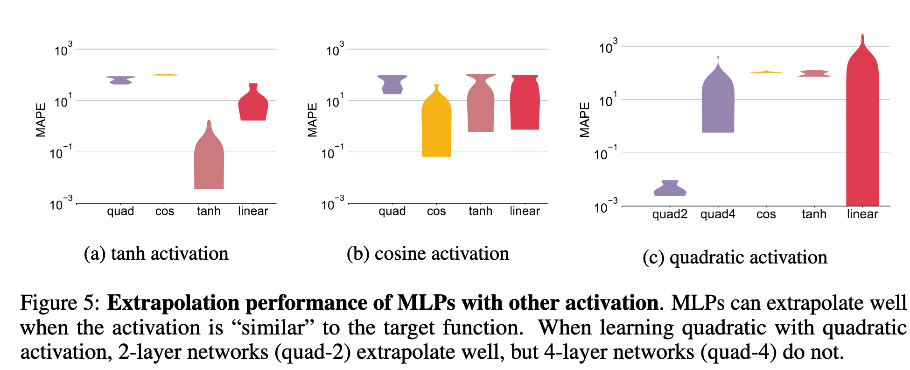

本文是  的论文解读。OpenReview显示这篇论文是ICLR2021的Oral论文（前5%）。

## 引言

人类具有泛化性，例如学会算术后可以应用到任意大的数字。对于神经网络而言，前馈网络（也叫多层感知机，MLPs）在学习简单的多项式函数时就不能很好地泛化了。然而，基于MLP的图神经网络（GNNs）却在近期的一些任务上表现出较好的泛化性，包括预测物理系统的演进规律，学习图论算法，解决数学公式等。
粗略地分析可能会觉得神经网络可以在训练分布以外的数据上有任意不确定的表现，但是现实中的神经网络大多是用梯度下降训练的，这就导致其泛化性能有规律可以分析。作者使用"神经切线核"（neural tangent kernel，NTK）工具进行分析。

本文的第一个结论是使用梯度下降训练的MLPs会收敛到任意方向线性的函数，因此MLPs在大多数非线性任务上无法泛化。
接着本文将分析延伸到基于MLP的GNNs，得到第二个结论：

## 前置知识

设$\mathcal{X}$表示数据（向量或图）的域。任务是学习一个函数$g:\mathcal{X}\to \mathbb{R}$，其中训练数据$\\{(\pmb{x}_i,y_i)\\}\in\mathcal{D}$，$y_i=g(\pmb{x_i})$，$\mathcal{D}$表示训练数据的分布。在训练数据和测试数据同分布的情况下，$\mathcal{D}=\mathcal{X}$；而在评估泛化能力时，$\mathcal{D}
$是$\mathcal{X}$的子集。一个模型的泛化能力可以用**泛化误差**评估：设$f$为模型在训练数据上得到的函数，$l$为任意损失函数，则泛化误差定义为$\mathbb{E}\_{\pmb{x}\sim \mathcal{X} \setminus \mathcal{D}}[l(f(\pmb{x}), g(\pmb{x}))]$

图神经网络GNNs是在MLPs基础上定义的网络。具体来说，初始顶点表征为$\pmb{h}_u^{(0)}=\pmb{x}_u$。在第$k=\{1..K\}$层，顶点表征更新公式为

$$\begin{aligned}\pmb{h}\_u^{(k)}&=\sum_{v\in\mathcal{N}(u)}\text{MLP}^{(k)}(\pmb{h}\_u^{(k-1)},\pmb{h}\_v^{(k-1)},\pmb{w}\_{(v,u)}) \\\ 
\pmb{h}\_G&=\text{MLP}^{(K+1)}(\sum_{u\in G}\pmb{h}\_u^{(K)})\end{aligned}$$

其中$\pmb{h}\_u^{(k)}$表示第$k$层GNN输出的顶点$u$的表征，$\pmb{h}\_G$表示整张图的表征。$\pmb{h}\_u^{(k)}$的计算过程称为聚合，$\pmb{h}\_G$的计算过程称为读出。以往研究大多使用求和聚合与求和读出，而本文指出替换为另外的函数能够提升泛化性能。

## 前馈网络MLPs如何泛化

### ReLU MLPs的线性泛化

作者用下图呈现MLPs的泛化方式。灰色表示MLPs要学习的真实函数，蓝色和黑色分别表示模型在训练集和测试集上的预测。可以看到模型可以拟合训练集上的非线性函数，但脱离训练集后迅速变为线性函数。用数字来说，脱离训练集后MLPs预测的决定系数大于$0.99$。

**定理1**（线性泛化）：假设在NTK机制下使用均方误差训练了一个两层MLP：$f:\mathbb{R}^d\to\mathbb{R}$。对于任意方向$\pmb{v}\in\mathbb{R}^d$，令$\pmb{x}_0=t\pmb{v}$，那么当$t\to\infty$时，$f(\pmb{x}_0+h\pmb{v})-f(\pmb{x}_0)\to\beta_vh$对任意的$h>0$成立，$\beta_v$是常数。进一步地，给定$\epsilon>0$，对于$t=O(\frac{1}{\epsilon})$，$|\frac{f(\pmb{x}_0+h\pmb{v})-f(\pmb{x}_0)}{h}-\beta_v|<\epsilon$。

定理1说明了在训练数据集以外，ReLU MLPs可以拟合几乎线性的函数。对于二次函数（$\pmb{x}^TA\pmb{x}$）、余弦函数($\sum_{i=1}^d\cos(2\pi\cdot\pmb{x}^{(i)})$)、根次函数（$\sum_{i=1}^d\sqrt{\pmb{x}^{(i)}}$）等，ReLU MLPs不能泛化。
在合适的超参数下，MLPs可以正确地泛化L1范数，与定理1一致。如下图所示。

### ReLU MLPs什么时候一定（provably）可以泛化

尽管上图显示MLPs对于线性函数可以较好地泛化，但这需要一定的条件，即训练数据集的分布必须足够“多样”。下面的引理1指出只需要$2d$条认真挑选的数据就可以实现ReLU MLPs的线性泛化。

**引理1**：令$g(\pmb{x})=\pmb{\beta}^T\pmb{x}$表示待拟合的目标函数，$\pmb{\beta}\in\mathbb{R}^d$。假设数据集$\\{\pmb{x}\_i\\}\_{i=1}^n$包含正交基$\\{\hat{\pmb{x}}\_i\\}\_{i=1}^d$和$\\{-\hat{\pmb{x}}\_i\\}\_{i=1}^d$。若使用均方误差在$\\{({\pmb{x}}\_i,y_i)\\}\_{i=1}^n$上训练一个两层ReLU MLP，那么$f({\pmb{x}})={\pmb{\beta}}^T{\pmb{x}}$对任意的${\pmb{x}}\in\mathbb{R}^d$成立。

然而，仔细挑选出$2d$条符合条件的样本并不容易。下面的定理2基于更现实的场景，指出只要训练数据的分布包含所有的方向（例如一个包含原点的超球），那么在足够的训练数据量下MLP能够收敛到线性函数。

**定理2**（泛化的条件）：令$g(\pmb{x})=\pmb{\beta}^T\pmb{x}$表示待拟合的目标函数，$\pmb{\beta}\in\mathbb{R}^d$。假设$\\{\pmb{x}\_i\\}\_{i=1}^n$从域$\mathcal{D}$中采样，其中$\mathcal{D}$包含一个连通的子集$S$，满足对任意非零向量$\pmb{w}\in\mathbb{R}^d$，存在$k>0$使得$k\pmb{w}\in S$。若在NTK机制下，使用均方误差在$\\{({\pmb{x}}\_i,y_i)\\}\_{i=1}^n$上训练一个两层ReLU MLP，$f(\pmb{x})\xrightarrow{p}\pmb{\beta}^T\pmb{x}$在$n\to\infty$时成立，即$f$依概率收敛到$g$。

定理2说明了为什么数据集中“虚假”的相关性（真实不应存在的相关性）会损害模型的泛化性能，补充了因果推理的论点。例如，如果人工收集的训练图片中只有在沙漠中的骆驼，这里骆驼和沙漠就是数据集不够“多样”导致的虚假相关性，实际上骆驼还生活在草原等多种环境上。那么此时定理2的条件不再满足，模型也可能因此不能很好地泛化。

总的来说，定理1指出MLPs对于大多数非线性函数不能泛化，定理2指出MLPs当训练数据足够多样时能够在线性目标函数下泛化。

### 使用其他激活函数的MLPs

以上讨论都基于使用ReLU激活函数的MLPs。除了ReLU，还有$\tanh(x),\cos(x),x^2$等激活函数。作者发现，在激活函数和待拟合的目标函数相近时，MLPs的泛化性能较好。

## 图神经网络GNNs如何泛化

以上讨论说明了MLPs在非线性任务上难以泛化。然而基于MLPs的GNNs却在一些非线性任务上表现出良好的泛化性，例如直观物理（intuitive Physics）、图论算法（graph algorithms）、符号数学（symbolic mathematics）等。

### 假设：线性对齐辅助了GNNs的泛化

GNNs可以被用来解决最短路径问题。人们发现在GNN的聚合函数中使用最小$\min$函数后，训练后的GNN可以较好地泛化到比训练集更大的图上：

$$\pmb{h}\_u^{(k)}=\min_{v\in\mathcal{N}(u)}\text{MLP}^{(k)}(\pmb{h}\_u^{(k-1)},\pmb{h}\_v^{(k-1)},\pmb{w}\_{(v,u)})$$

另一方面，传统的最短路问题可以通过Bellman-Fold（BF）算法解决：

$$d[k][u]=\min_{v\in\mathcal{N}(u)}d[k-1][v]+\pmb{w}(v,u)$$

其中$\pmb{w}(v,u)$表示边$(v,u)$的权重，$d[k][u]$表示$k$步以内到达节点$u$的最短距离。可以发现BF算法的更新式子可以很容易地与GNN的更新式子对齐，只需令MLP学习一个线性函数$d[k-1][v]+\pmb{w}(v,u)$即可。由于MLPs可以较好地对线性目标函数泛化，所以GNNs可以在计算最短路径问题上良好地泛化。
反之，如果将GNN的聚合函数中使用$\text{sum}$或其他函数，那么MLP就需要学习一个非线性目标函数，导致其无法泛化（定理1），进而GNN无法泛化。